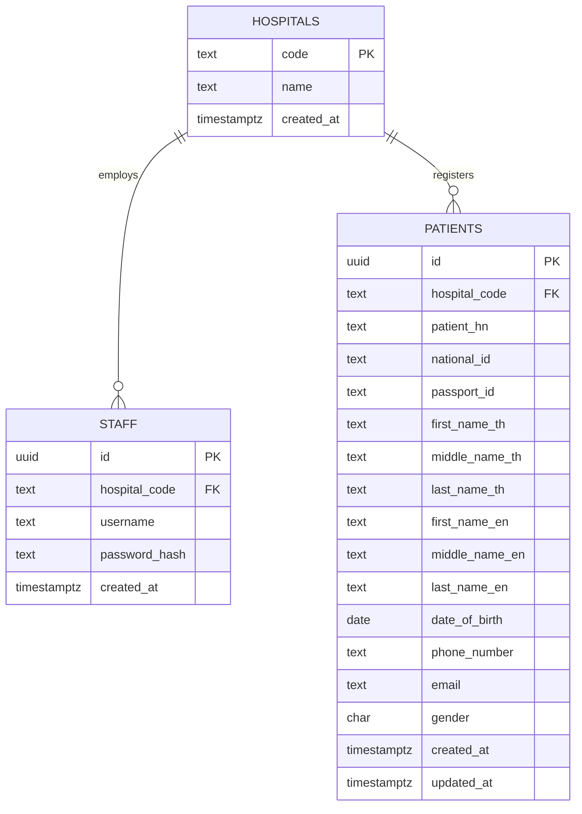

# hospital-middleware

A small service that lets hospital staff log in and search patient records. Each staff member
belongs to one hospital and only ever sees that hospital's patients. Patient data lives in each
hospital's information system (HIS); the middleware keeps a local copy in Postgres so that staff
can search by any combination of fields, and fills that copy from the HIS when a search by id
finds nothing locally.

Go, Gin, Postgres, nginx, Docker Compose.

## Run

```
docker compose up --build
```

nginx listens on port 80 and proxies to the service. Postgres and a mock of the Hospital A API
run inside the stack and are not published. Migrations run when the service starts.

Walkthrough (the mock knows national ids `1234567890121` and `3101234567893` and passport
`AB1234567`; `jq` is only used to pull the token out of the login response):

```
curl -s -X POST localhost/staff/create -H 'Content-Type: application/json' \
  -d '{"username":"nurse.a","password":"correct horse battery","hospital":"hospital-a"}'

TOKEN=$(curl -s -X POST localhost/staff/login -H 'Content-Type: application/json' \
  -d '{"username":"nurse.a","password":"correct horse battery","hospital":"hospital-a"}' | jq -r .token)

# first search by id: not in the local copy yet, fetched from Hospital A and stored
curl -s -X POST localhost/patient/search -H "Authorization: Bearer $TOKEN" \
  -H 'Content-Type: application/json' -d '{"national_id":"1234567890121"}'

# now searchable by any field
curl -s -X POST localhost/patient/search -H "Authorization: Bearer $TOKEN" \
  -H 'Content-Type: application/json' -d '{"first_name":"somchai"}'
```

A staff member of `hospital-b` running the same searches gets `{"patients":[]}`.

## API

Requests and responses are JSON. Errors are `{"error":"<message>"}` with 400 for invalid input,
401 for missing or invalid tokens and wrong credentials, 409 for conflicts, 502 when the hospital
system was needed and did not answer.

### POST /staff/create

```
{"username": "nurse.a", "password": "correct horse battery", "hospital": "hospital-a"}
```

`username`: 3 to 64 characters of letters, digits, `.`, `_`, `-`, unique within the hospital.
`password`: 8 to 72 bytes. `hospital`: a known hospital by code or name (`hospital-a` /
`Hospital A`, `hospital-b` / `Hospital B`).

201 `{"id": "<uuid>", "username": "nurse.a", "hospital": "hospital-a"}`. 400 on validation or an
unknown hospital, 409 when the username exists in that hospital.

### POST /staff/login

Same three fields. 200 `{"token": "<jwt>", "expires_at": "2026-09-17T13:00:00Z"}`. 401
`invalid credentials` whether the hospital, the username or the password is wrong.

### POST /patient/search

`Authorization: Bearer <token>` required. Every field is optional; provided fields are combined
with AND. `first_name`, `middle_name` and `last_name` match either the Thai or the English name,
case-insensitively. `date_of_birth` is `YYYY-MM-DD`. Blank fields count as absent. An empty body
returns the hospital's patients.

```
{"national_id": "1234567890121", "passport_id": null, "first_name": null, "middle_name": null,
 "last_name": null, "date_of_birth": null, "phone_number": null, "email": null}
```

200:

```
{"patients": [{
  "id": "9a7d3b2e-1c4f-4e8a-9b1d-2f3e4a5b6c7d", "hospital": "hospital-a", "patient_hn": "000123",
  "national_id": "1234567890121", "passport_id": null,
  "first_name_th": "สมชาย", "middle_name_th": null, "last_name_th": "ใจดี",
  "first_name_en": "Somchai", "middle_name_en": null, "last_name_en": "Jaidee",
  "date_of_birth": "1985-03-14", "phone_number": "0812345678",
  "email": "somchai@example.com", "gender": "M"
}]}
```

The hospital is always the one in the token; no request field can widen it. The local copy is
searched first. If nothing matches and the request carries a national id or passport id, the
hospital's HIS is asked for that id; a hit is stored and the search is run again so the other
criteria still apply. Results are ordered by hospital number and capped at 100. The search is a
POST so that personal identifiers never appear in access logs.

400 for a malformed body, bad date or bad email. 401 without a valid token. 502 when the HIS
failed.

### GET /healthz

200 `{"status":"ok"}`.

### Upstream: Hospital A

`GET {HOSPITAL_A_BASE_URL}/patient/search/{id}`, `id` a national id or passport id. 200 returns
`first_name_th, middle_name_th, last_name_th, first_name_en, middle_name_en, last_name_en,
date_of_birth, patient_hn, national_id, passport_id, phone_number, email, gender`; 404 when
unknown. `cmd/hismock` implements this contract from a small fixture file. Assumed and mirrored
by the mock: dates are `YYYY-MM-DD`, gender is `M` or `F`, unknown ids are 404.

## Project structure

```
cmd/api              service entry point: config, migrations, wiring, graceful shutdown
cmd/hismock          stand-in for the Hospital A API (stdlib, embedded fixtures)
internal/config      environment configuration
internal/domain      entities, search criteria, sentinel errors
internal/auth        bcrypt hashing, JWT issue and verify
internal/his         HIS client interface and registry; hospitala/ is the Hospital A client
internal/service     staff creation and login, hospital-scoped search with HIS fallback
internal/repository  Postgres repositories (pgx) and the migrations runner
internal/rest        Gin router, handlers, validation, bearer middleware
migrations           versioned SQL, embedded and applied at start
deploy               nginx config, test database init
```

`rest` calls `service`; `service` uses `domain`, `auth`, `his` and the repository interfaces it
declares; `repository/postgres` implements them. Interfaces sit next to the code that uses them,
so each layer is tested with small hand-written fakes.

## Data model



- `hospitals.code` is the natural key: it is what the API inputs, the token and the HIS registry
  carry. Rows are seeded by the migration.
- `staff`: `(hospital_code, username)` is unique. Passwords are bcrypt hashes.
- `patients`: `(hospital_code, patient_hn)` is unique because the hospital number is the HIS's
  own identity. `national_id` and `passport_id` are nullable and indexed but not unique, since
  real hospital data contains duplicate registrations. Columns mirror the HIS fields one to one.

## Tests

```
make test       # unit tests, no Docker needed
make test-db    # repository tests against Postgres from the compose file
make cover      # coverage per package
make lint       # go vet and gofmt
```

Handlers are tested through the router with fake services; services with fake repositories and a
fake HIS; the Hospital A client against an httptest server; repositories against a real database
(skipped when `TEST_DATABASE_URL` is unset). Each API has positive and negative cases:
validation, duplicates, wrong credentials, missing and expired tokens, hospital isolation, HIS
not found and HIS unavailable.

## Configuration

| variable | default | notes |
|---|---|---|
| `PORT` | `8080` | |
| `DATABASE_URL` | required | |
| `JWT_SECRET` | required | the compose file ships a development value |
| `JWT_TTL` | `24h` | |
| `HOSPITAL_A_BASE_URL` | empty | empty means Hospital A searches use the local copy only |
| `HIS_TIMEOUT` | `5s` | |

## Limitations

No pagination (results are capped at 100), no token refresh or revocation, no roles (staff
creation is open, as the brief specifies), the local copy is refreshed only on a miss, and only
the Hospital A interface is integrated. Each would be the next step in a real deployment.
